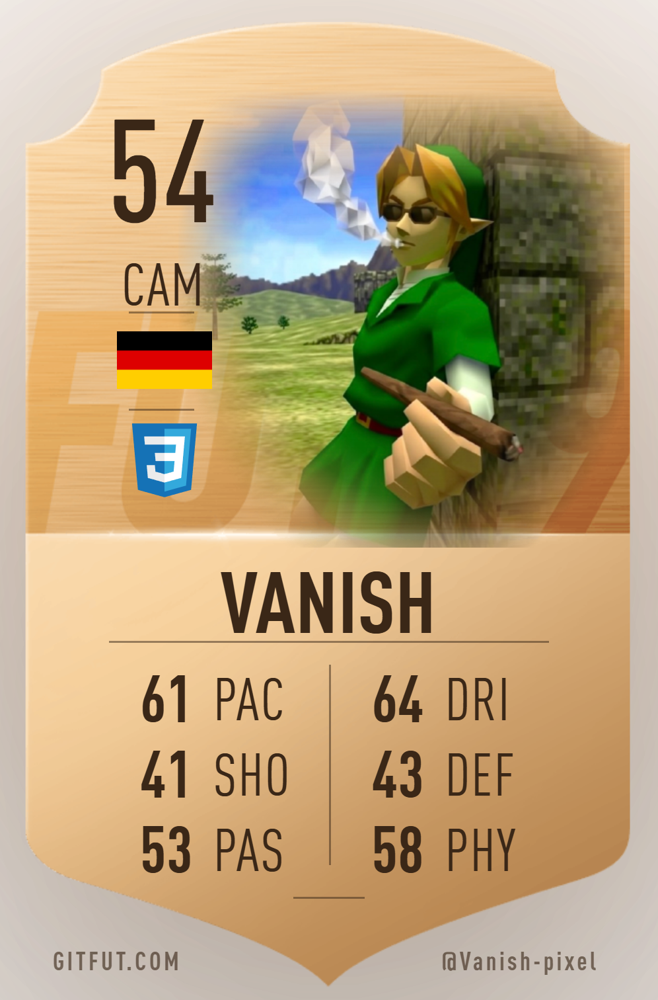

  

<table align="center">
  <tr>
    <td width="42%" align="center" valign="middle">
      
    </td>
    <td width="58%" valign="middle">
      
IT enthusiast turning ideas into practical projects around <b>systems, networking and cybersecurity</b> — and helping online communities grow.

      
Now &nbsp;·&nbsp; community &amp; project management @ <a href="https://skydinse.net">skydinse.net</a>

      

        
        &nbsp;
        
        &nbsp;
        
      

    </td>
  </tr>
</table>

  

  
  &nbsp;&nbsp;
  
   
  Cisco Networking Academy · verified

  <picture>
    <source media="(prefers-color-scheme: dark)" srcset="https://raw.githubusercontent.com/Vanish-pixel/Vanish-pixel/output/github-contribution-grid-snake-dark.svg" />
    
  </picture>

