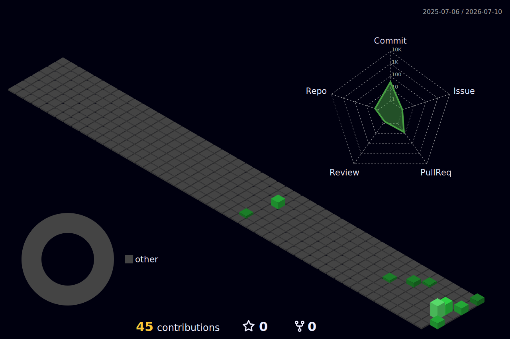

<div align="center">


</div>

## `~/about`

```console
valentin@skydinse:~$ cat about.txt
cat: about.txt: Permission denied

valentin@skydinse:~$ sudo !!
runs skydinse servers · writes skript · reboots stuff until it works
```

## `~/loadout`

<div align="center">


</div>

## `~/activity`

<div align="center">




<picture>
  <source media="(prefers-color-scheme: dark)" srcset="https://raw.githubusercontent.com/Vanish-pixel/Vanish-pixel/output/github-contribution-grid-snake-dark.svg" />
  
</picture>

</div>

## `~/ping valentin`

<div align="center">

[](https://discord.com/users/vaniish7_)
&nbsp;
[](mailto:vanish.management@gmx.de)

</div>
