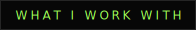
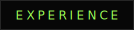
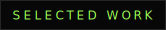

 
 

 

`C#` · `HTML & CSS` · `Git & GitHub` · `Linux` · `Networking` · `Discord Bots` · `Minecraft Servers`

 

 

**Community & Project Management** · [skydinse.net](https://skydinse.net) 
Community management, coordination of community projects, event organization and team support.

 

 

**[Portfolio Website](https://vanish-pixel.github.io/portfolio/)** 
A minimal personal portfolio built with HTML, CSS and JavaScript — hosted on GitHub Pages.

**Discord Warning Bot** 
A Discord bot for internal team warnings, structured warning levels and logging.

 

---

[Portfolio ↗](https://vanish-pixel.github.io/portfolio/) &nbsp;·&nbsp; [Discord ↗](https://discord.com/users/1333795027444564071) &nbsp;·&nbsp; [Mail ↗](mailto:vanish.management@gmx.de)
