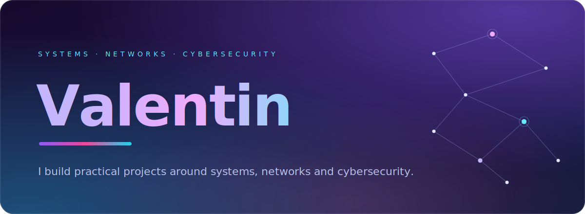

  
  &nbsp;
  
  &nbsp;
  

## About me

> I am Valentin, an IT enthusiast focused on **systems, networking and cybersecurity**.
> I enjoy turning ideas into practical projects, learning how infrastructure works and helping online communities grow.

## What I work with

| Area | Stack |
| :-- | :-- |
| **Development** |     |
| **Tools & platforms** |    |
| **Infrastructure** |   |
| **Automation** |   |

## Experience

**Community & Project Management** · [skydinse.net](https://skydinse.net)

Community management, coordination of community projects and event organization. I focus on clear communication, reliable processes and creating a good experience for community members.

## Selected work

<table>
  <tr>
    <td width="50%" valign="top">
      <h3><a href="https://vanish-pixel.github.io/portfolio/">Portfolio Website</a></h3>
      
A responsive personal portfolio built with HTML, CSS and JavaScript and hosted on GitHub Pages.

    </td>
    <td width="50%" valign="top">
      <h3>Discord Warning Bot</h3>
      
A Discord bot for internal team warnings with structured warning levels and logging. Built to make moderation workflows clearer and easier to track.

    </td>
  </tr>
</table>
