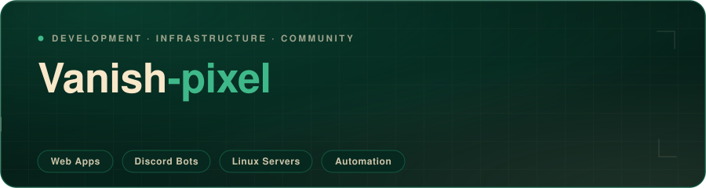

  

  
  
  

  

## Overview

I build and run things on both sides of the stack — the interfaces people use, and the servers they run on.
Most of my work sits somewhere between web development, bots and infrastructure, with a strong focus on
clean structure, automation and long-living setups.

## Current Focus

- Modern web applications, team dashboards and management systems
- Discord bots for moderation, tickets and warning workflows
- Minecraft server and network administration
- Linux / Ubuntu servers, selfhosting and reproducible setups
- Automated deployments straight from GitHub

  

## Tech

**Languages &amp; Technologies**

  
  
  
  
  
  
  

**Tools**

  
  
  
  
  
  
  
  

**Systems**

  
  
  
  

  

## What I Build

| Area | Work |
| :--- | :--- |
| **Web** | Websites and web applications, modern team dashboards, upload and download platforms, selfhosted web tools |
| **Bots** | Discord warning and management systems, ticket and moderation bots |
| **Minecraft** | Server administration, network and community projects, Skript-based systems |
| **Infrastructure** | Linux and Ubuntu servers, selfhosted services, Docker and PM2 setups, SSH-based administration |
| **Delivery** | Git-based workflows and automatic deployments from GitHub |

> Not every project is solo work. Depending on the project I take the role of developer,
> server administrator, or project and community management — sometimes several, sometimes one part of a team.

## How I Work

- **Structure first** — readable projects beat clever one-offs
- **Automate the repetition** — deployments, restarts and routine tasks belong to scripts
- **Reproducible servers** — a setup should be rebuildable, not remembered
- **Ship through Git** — branches, history and automated deploys instead of manual uploads
- **Maintain what I build** — projects that keep running matter more than projects that launch

  

## Connect

  
  

Feel free to look through my repositories — most of my work lives there, some of it stays on the servers it runs on.

  

  <b>Vanish-pixel</b> &nbsp;&#183;&nbsp; Web &nbsp;&#183;&nbsp; Bots &nbsp;&#183;&nbsp; Servers &nbsp;&#183;&nbsp; Automation

